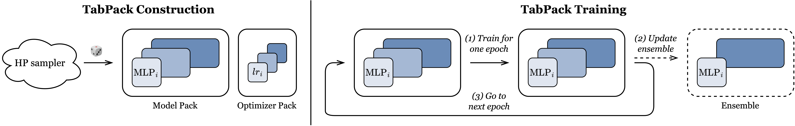

# TabPack: Efficient Hyperparameter Ensembles for Tabular Deep Learning (ICML 2026)<!-- omit in toc -->

:scroll: [arXiv](https://arxiv.org/abs/2507.TODO)
&nbsp; :books: [Other tabular DL projects](https://github.com/yandex-research/rtdl)

This is the official repository of the paper "TabPack: Efficient Hyperparameter Ensembles for Tabular Deep Learning".

> [!IMPORTANT]
> The purpose of this code, in its _current_ state, is to enable reproduction of the main experiments from the paper.
>
> **A minimal implementation of TabPack for general use will be announced separately.**
> Follow [this page](https://x.com/YuraFiveTwo) to stay updated.

# TL;DR<!-- omit in toc -->



**TabPack is an efficient ensemble of MLPs with different model and optimizer hyperparameters**, for solving supervised learning tasks on tabular data.
In a single run, TabPack samples and trains many MLPs with different hyperparameters efficiently in parallel and selects ensemble members on the fly during training.
See the paper for details.

The main applied properties of TabPack include **competitive out-of-the-box performance** on medium-to-large datasets, **reduced reliance on hyperparameter tuning** and **reasonable training and inference efficiency**.
Overall, TabPack reduces time and compute resources needed to achieve competitive performance, and offers a **good starting point for solving tabular ML tasks**.

# Overview

**Layout**

| Code                     | Comment                                           |
| :----------------------- | :------------------------------------------------ |
| `experiments`            | Configs and results of the experiments            |
| `scripts`                | Executable scripts that are never imported        |
| `src`                    | Importable Python modules                         |
| `src/lib`                | A generic module for tabular DL research projects |
| `src/project`            | The module specific to the TabPack project        |
| `src/project/tabpack.py` | The TabPack model definition and training code    |
| `src/project/nn.py`      | The main building blocks of the TabPack model     |
| `src/project/optim.py`   | The optimizers used by TabPack                    |
| `src/vendor`             | Unmodified third-party code                       |

The `experiments` directory is structured as follows:

> [!NOTE]
> To understand the difference between the "main" and "evaluation" runs of TabPack, see the definition of the "Conservative" experiment protocol in the paper.

```
experiments/
  <model>/
    <dataset>/
      main/  # The main run.
      eval-*-ensembles/
        greedy/
          evaluation/  # The evaluation run.
    make.py  # A script for generating experiment configs and commands.
```

**Models**

All available models are represented by the `Model` class from `src/project/tabpack.py`.
The following table is a mapping between the model names used in the paper and their subdirectories in `experiments`.

| Model                                     | Experiments                          |
| :---------------------------------------- | :----------------------------------- |
| $\mathrm{TabPack}$                        | `experiments/tabpack`                |
| $\mathrm{TabPack^\dagger}$                | `experiments/tabpack-cosine`         |
| $\mathrm{TabPack^\dagger_\text{MacBook}}$ | `experiments/tabpack-cosine-macbook` |
| $\mathrm{TabPack^\dagger_\text{Offline}}$ | `experiments/tabpack-cosine-offline` |

**Metrics**

The metrics reported in the paper can be summarized from reports of _evaluation_ runs as follows:

<details>
<summary>Show</summary>

```python
import statistics

import lib.datasets
import lib.experiment

model = 'tabpack-cosine'
for dataset in lib.datasets.MAIN_DATASETS:
    exp = f'experiments/{model}/{dataset}/eval-online-ensembles/greedy/evaluation'
    report = lib.experiment.load_report(exp)
    scores = [
        x['report']['online_ensembles']['greedy']['report']['metrics']['test']['score']
        for x in report['experiments']
    ]
    print(
        f'{dataset:<25}'
        f'  {abs(statistics.mean(scores)):>11.4f}'
        f' +- {abs(statistics.stdev(scores)):>7.4f}'
    )

```

</details>

# Setting up the environment

The supported setups include Linux machines with GPU and macOS machines with M processors.

## Software

Clone the repository:

```shell
git clone https://github.com/yandex-research/tabpack
cd tabpack
```

> [!IMPORTANT]
> All commands must be run from the root of the repository.

Then, install [uv](https://docs.astral.sh/uv) and run:

```
uv sync
```

## Data

***License:** we do not impose any new license restrictions in addition to the original licenses of the used dataset. See the paper to learn about the dataset sources.*

```
wget https://zenodo.org/records/18411966/files/tabpack-data.tar.gz
tar -xzvf tabpack-data.tar.gz
```

The TabReD datasets should be downloaded separately following the official TabReD instructions: [link](https://github.com/yandex-research/tabred).

## Quick test

At this point, the following command should run successfully:

```
uv run -m lib.examples.demo experiments/examples/demo --force
```

As well as the following commands:

```
uv run ruff check
uv run ty check
```

# Reproducing experiments

Let's say you want to reproduce the experiments from `experiments/tabpack`.
Then, complete the following steps.

Create a new experiment subdirectory:

```
mkdir -p experiments/reproduce/tabpack
```

Copy the original experiment factory script to the newly created directory:

```
cp experiments/tabpack/make.py experiments/reproduce/tabpack
```

Run it to generate experiment configs and commands for all datasets:

```
uv run experiments/reproduce/tabpack/make.py
```

Check the result:

```
ls experiments/reproduce/tabpack
```

In particular, take a look at the generated command file:

```
cat experiments/reproduce/tabpack/commands.sh
```

> [!TIP]
>
> When completing this instruction for the first time, keep only the very first experiment command to run experiments only for one small dataset (Churn):
>
> ```
> $EDITOR experiments/reproduce/tabpack/commands.sh
> ```

Run the experiments:

```
sh experiments/reproduce/tabpack/commands.sh
```

# Understanding the codebase

The recommended way to understand how the codebase works is to read `lib/examples/demo.py`.
Then, explore the codebase as needed.

# How to cite

```
@inproceedings{gorishniy2026tabpack,
    title={{TabPack: Efficient Hyperparameter Ensembles for Tabular Deep Learning}},
    author={Yury Gorishniy and Akim Kotelnikov and Ivan Rubachev and Artem Babenko},
    booktitle={ICML},
    year={2026},
}
```
